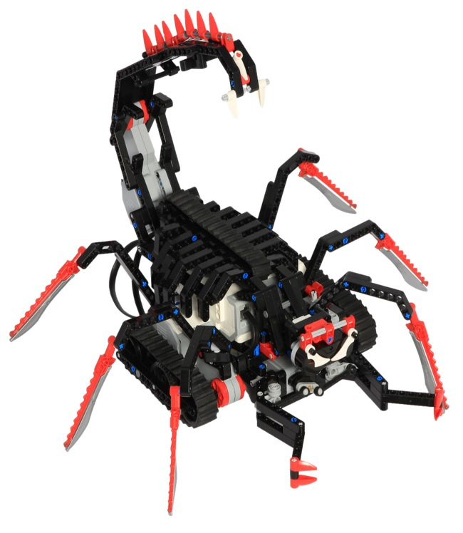

# EV3
Lejos project NuuNuu-robotti

NuuNuu on kauko-ohjattava skorpioni-robotti.
Kauko-ohjauksen lisäksi NuuNuu pystyy liikkumaan myös itsekseen.

Ominaisuudet:
Robotti pystyy kauko-ohjauksella liikkumaan eteenpäin, kääntymään oikealle ja vasemmalle sekä peruuttamaan. Skorpionilla on tyypillisesti häntä ja sakset, joita pystyy kauko-ohjaimen nappien painalluksella komentaa. NuuNuussa on myös automaattinen-ohjaus valmiiksi asennettuna, jolloin robotti liikkuu itsestään törmäämättä kuitenkaan seiniin. Robotti pitää ääntä ja välkyttää punaisia valoja liikuttaessaan häntää tai saksia.

